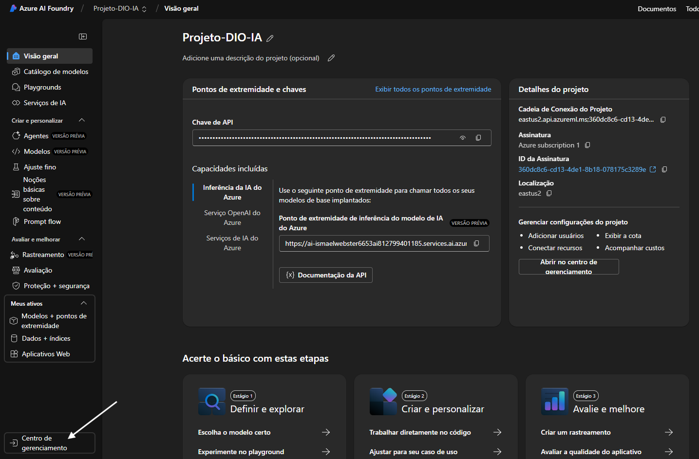
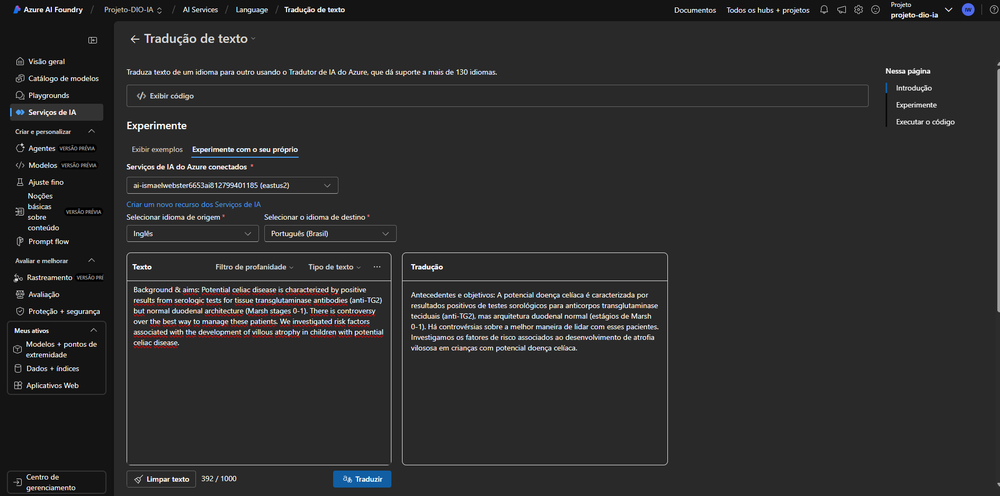

# 🧪 Testes: Explorando o Portal Open Azure AI Foundry

Documentação dos testes realizados utilizando o Azure OpenAI Studio.

---

## Configuração

Para esta etapa de testes, foi necessário criar um projeto dentro deste portal para que fosse possível testar suas funcionalidades. Em seguida foi adicionado o recurso Azure AI Services em uma região diferente. Após a criação, foi realizada a conexão com o projeto atual, tornando possível o uso de recursos de IA, como observado nas imagens a seguir:

Neste teste em específico, foi testado o serviço de tradução utilizando os recursos de IA do Azure, mas a traduçao não teve o cunho de avaliar o contexto para relizar uma tradução com maior qualidade e clareza. Assim o resultado foi mediano, como se a tradução fosse realizada palavra por palavra utilizando um dicionário.

## Resultados

Foi observado que a tradução em si não obteve grande qualidade, principalmente levando em questão que o texto tinha cunho mais científico, portanto, vale testar o mesmo conteúdo em um serviço de IA implantado, como o ChatGPT 4 ou 4o para avaliar os resultados.
